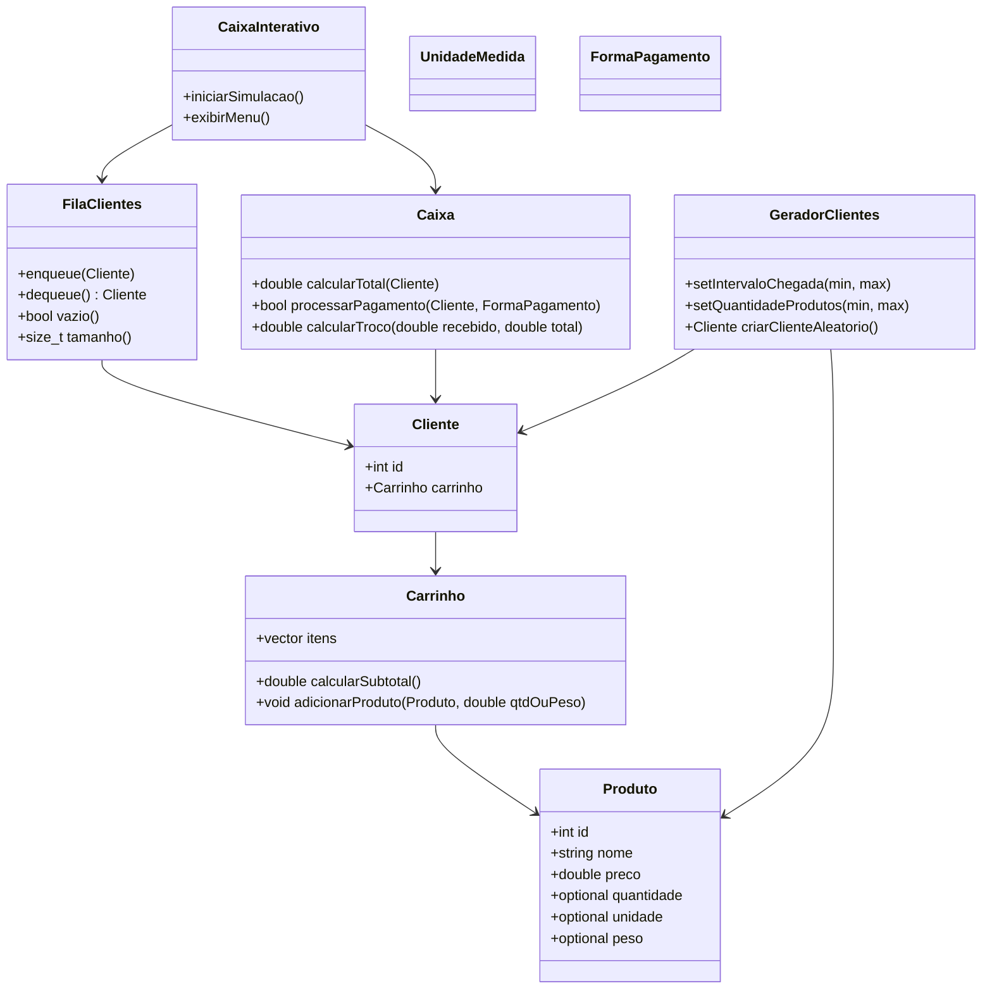
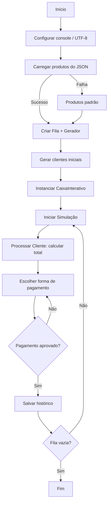
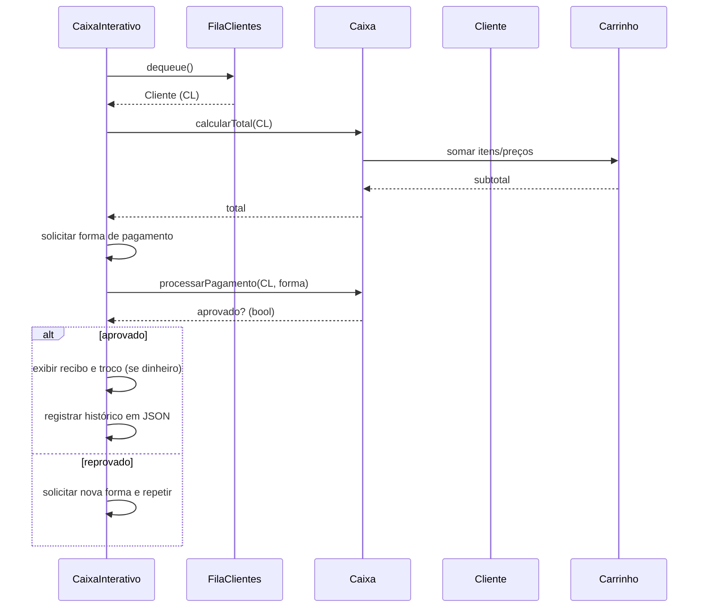

# Simulação de Caixa de Supermercado com Filas

## Sumário

- [Visão Geral e Objetivos](#visão-geral-e-objetivos)
- [Arquitetura e Design de Software](#arquitetura-e-design-de-software)
- [Modelagem de Domínio (Classes)](#modelagem-de-domínio-classes)
- [Estruturas de Dados e Algoritmos](#estruturas-de-dados-e-algoritmos)
- [Fluxos do Sistema](#fluxos-do-sistema)
- [Persistência e Formatos de Dados](#persistência-e-formatos-de-dados)
- [Guia de Compilação e Execução](#guia-de-compilação-e-execução)
- [Métricas, Limitações e Roadmap](#métricas-limitações-e-roadmap)
- [Demonstração (Roteiro do Seminário)](#demonstração-roteiro-do-seminário)
- [Perguntas Frequentes (FAQ)](#perguntas-frequentes-faq)
- [Glossário](#glossário)
- [Como Contribuir](#como-contribuir)
- [Licença](#licença)

---

## Visão Geral e Objetivos

Este projeto simula o funcionamento de um caixa de supermercado: clientes chegam e formam uma fila (FIFO), cada cliente possui um carrinho com produtos, e o caixa processa o pagamento (dinheiro, débito, crédito, PIX). O objetivo é aplicar conceitos essenciais de POO (encapsulamento, composição, responsabilidade única) e de Estruturas de Dados (filas e vetores), além de persistência com arquivos JSON.

## Arquitetura e Design de Software

A arquitetura é modular, com responsabilidades claras distribuídas entre classes de domínio e uma camada de orquestração para interação via console.

- Principais diretórios:
  - `include/` — `Produto.hpp`, `Carrinho.hpp`, `Cliente.hpp`, `FilaClientes.hpp`, `Caixa.hpp`, `CaixaInterativo.hpp`, `FormaPagamento.hpp`, `GeradorClientes.hpp`, `UnidadeMedida.hpp`, `json.hpp` (lib `nlohmann/json` header-only)
  - `src/` — implementações correspondentes

- Camadas:
  - Domínio: `Produto`, `Carrinho`, `Cliente`, `FilaClientes`.
  - Regras de Negócio: `Caixa`, `FormaPagamento`.
  - Orquestração/UI: `CaixaInterativo` (console) e `GeradorClientes` (simulação).

### Diagrama de Classes (conceitual)



### Princípios de Design (POO)

- Encapsulamento: cada classe guarda seus dados e operações (ex.: `Carrinho::calcularSubtotal()`).
- Composição: `Cliente` possui `Carrinho`; `FilaClientes` contém `Cliente`.
- Responsabilidade Única: classes focadas em um propósito.
- Extensibilidade: novas formas de pagamento e regras podem ser adicionadas com baixo acoplamento.

---

## Modelagem de Domínio (Classes)

A seguir, um panorama das classes e suas responsabilidades, com referências aos headers em `include/`:

- `Produto` (`include/Produto.hpp`): identifica item pelo `id`, `nome`, `preco`; suporta medição por `quantidade` e `unidade` ou por `peso`.
- `UnidadeMedida`/`UtilUnidade` (`include/UnidadeMedida.hpp`): enum e funções utilitárias para mapeamento de strings JSON.
- `Carrinho` (`include/Carrinho.hpp`): mantém itens e quantidades/pesos; calcula subtotal.
- `Cliente` (`include/Cliente.hpp`): agrega um `Carrinho` e um identificador.
- `FilaClientes` (`include/FilaClientes.hpp`): estrutura FIFO de clientes.
- `FormaPagamento` (`include/FormaPagamento.hpp`): enum Dinheiro/Débito/Crédito/PIX, com lógica associada em `src/FormaPagamento.cpp`.
- `Caixa` (`include/Caixa.hpp`): regras de cobrança, cálculo de total e troco, validação de pagamento.
- `CaixaInterativo` (`include/CaixaInterativo.hpp`): laço de interface de console e orquestração da simulação.
- `GeradorClientes` (`include/GeradorClientes.hpp`): gera clientes/carrinhos pseudo-aleatórios com parâmetros configuráveis.

---

## Estruturas de Dados e Algoritmos

- Fila (`FilaClientes`): controla a ordem de atendimento (FIFO).
- Vetor (`std::vector`): lista de produtos e itens no carrinho.
- Enumerações: `FormaPagamento`, `UnidadeMedida` para modelar estados/variantes.

## Fluxos do Sistema

### Fluxo Geral (do início ao fim)



### Diagrama de Sequência (atendimento de um cliente)



---

## Persistência e Formatos de Dados

- Catálogo de produtos: `data/produtos.json`.
- Histórico de vendas (saída): `data/historico_compras.json`.
- Biblioteca de JSON: `include/json.hpp` (nlohmann/json, header-only).

Exemplo de `data/produtos.json`:

```json
{
  "produtos": [
    { "id": 1, "nome": "Arroz 1kg", "preco": 9.90, "quantidade": 1, "unidade": "kg" },
    { "id": 2, "nome": "Leite 1L", "preco": 4.99, "quantidade": 1, "unidade": "L" },
    { "id": 3, "nome": "Café 500g", "preco": 14.50, "peso": 0.5 }
  ]
}
```

Tratamento de erros:
- Ao falhar a leitura/parse do JSON, o sistema carrega um conjunto padrão de produtos e continua a execução, registrando feedback no console.

---

## Guia de Compilação e Execução

Pré-requisitos (Windows):
- Compilador C++ (g++/MinGW ou MSVC) com suporte a C++17.
- Inclusão do diretório `include/` no comando de compilação.

Compilação (exemplo com g++):

```bash
g++ -std=c++17 -O2 -Wall -Iinclude src/*.cpp main.cpp -o caixa_interativo.exe
```

Execução:

```bash
./caixa_interativo.exe
```

Arquivos de dados:
- Entrada: `data/produtos.json`
- Saída: `data/historico_compras.json`


